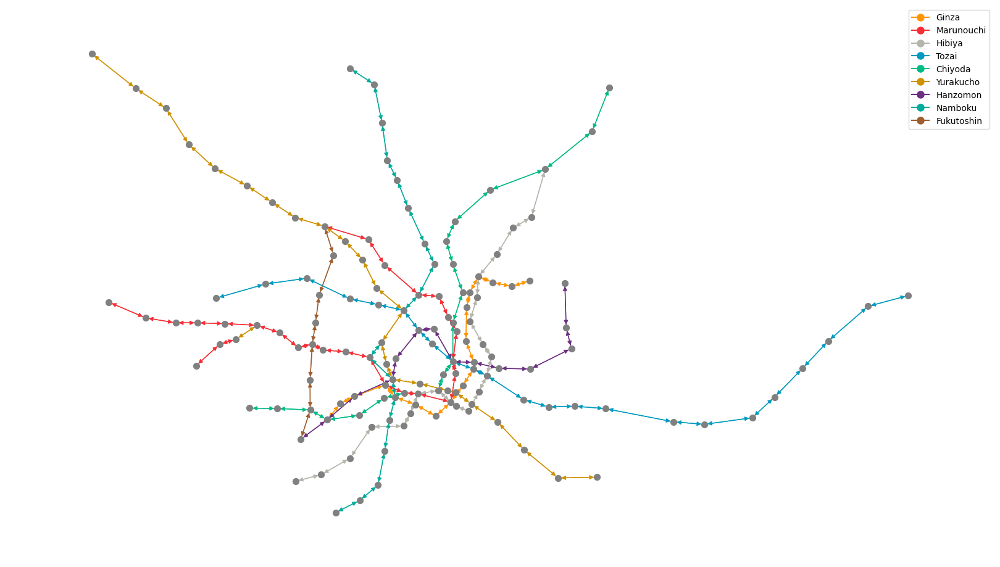

# A Robustness Analysis for the Tokyo Metro Urban Rail Network

**ABSTRACT:** For a system as large and complex as the Tokyo Metro urban rail network, failures in the stations and railways can render entire rail lines unusable. To identify locations that are most catastrophic if failed, we perform a robustness analysis. To do so, we constructed a novel dataset from various sources including the 13th Metropolitan Transportation Census and Tokyo Metro’s crowdedness visualization website. Some trains, such as the Tozai line, have long stretches of stations that connect residential areas to the city center, which are most catastrophic to the system at-large if failures occur anywhere along its line.

## 1. Datasets

There are four datasets scraped and processed for this paper, of which three were used to perform the robustness analysis.

### 1.1 Wikipedia

Graphical representation of the Tokyo Metro urban rail network. Different train lines are distinguished by color; however, some rail lines overlap as they travel between the same adjacent stations.

### 1.2 Tokyo Metro Train Crowdedness

The network of the Tokyo Metro, with the thickness of connections representing the crowdedness at four separate times.

### 1.3 Tokyo Metro Station Flow

The stations of the Tokyo Metro. The size of the bubble represents the net inflow (blue) or net outflow (red) of passengers in the station 
at four separate times.

## 2. Overview of the Project

The robustness analysis was made possible due to the transparency of the Tokyo government and the respective train companies. Tokyo Metro publishes its train and station crowdedness data. This data was used with census data collected from passengers traveling in the Tokyo urban rail network on an average weekday to create a NetworkX graph of the network and an array of 24 matrices that represent the number of people who demand a trip between two stations at a time between 1:00 and 24:00.

For the unevenly distributed radial network of the Tokyo urban rail, performing robustness tests show how different stations in varying areas affect passengers in the network to differing extents. The structure of the Tokyo urban rail network resembles a concentrated mesh-center in the center of the city with branches off shooting to the outskirts of the city and neighboring prefectures. When considering the network of the larger Kanto region, there exists multiple mesh centers with various branches connecting these centers. One of the train companies that operate in Tokyo is the Tokyo metro and their mesh-center is the center of Tokyo. This kind of structure exhibits a few vulnerabilities, of which the biggest is that a failure in a station of edge on the branch will render an entire branch unusable. In the case of some trains like the Tozai line, this would cause hundreds of thousands of passengers to overcrowd the stations that constitute the branch.

This type of network also possesses “link stations,” which are stations that connect branches to the center of the network. Failures in these stations would cause the largest number of passengers affected. However, as long as branch and link stations remain intact in the network, there always exists another path that a passenger could take between a pair of stations.
